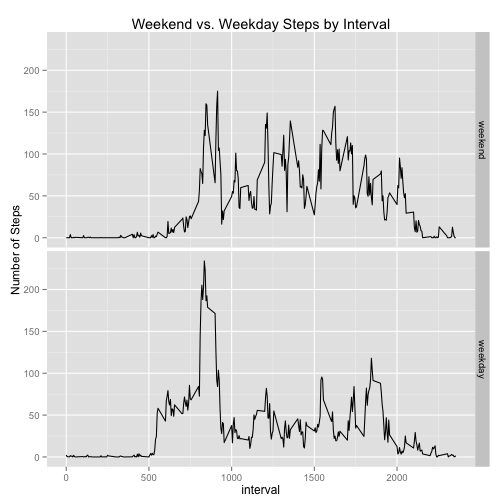

---
output:
  html_document:
    keep_md: yes
---
# Reproducible Research: Peer Assessment 1


## Loading and preprocessing the data
I used the dataset `activity.zip` that was contained in Dr. Peng's Github repository. We can use the `unzip` function from the `utils` package to automate the unzipping of the file.

```r
library(utils)
unzip("activity.zip")
dat <- read.csv("activity.csv", na.strings = "NA")
```

We can see three variables in the dataset, `steps`, `date`, and `interval`.

```r
str(dat)
```

```
## 'data.frame':	17568 obs. of  3 variables:
##  $ steps   : int  NA NA NA NA NA NA NA NA NA NA ...
##  $ date    : Factor w/ 61 levels "2012-10-01","2012-10-02",..: 1 1 1 1 1 1 1 1 1 1 ...
##  $ interval: int  0 5 10 15 20 25 30 35 40 45 ...
```

Date is a factor variable so we can change this to the `Date` class for more convenient calculations.


```r
dat$date <- as.Date(as.character(dat$date))
str(dat$date)
```

```
##  Date[1:17568], format: "2012-10-01" "2012-10-01" "2012-10-01" "2012-10-01" ...
```

```r
summary(dat)
```

```
##      steps            date               interval   
##  Min.   :  0.0   Min.   :2012-10-01   Min.   :   0  
##  1st Qu.:  0.0   1st Qu.:2012-10-16   1st Qu.: 589  
##  Median :  0.0   Median :2012-10-31   Median :1178  
##  Mean   : 37.4   Mean   :2012-10-31   Mean   :1178  
##  3rd Qu.: 12.0   3rd Qu.:2012-11-15   3rd Qu.:1766  
##  Max.   :806.0   Max.   :2012-11-30   Max.   :2355  
##  NA's   :2304
```

## What is mean total number of steps taken per day?

**Make a histogram of the total number of steps taken each day  **

One way to calculate the sum of the number of steps taken each day is to use the `ddply` function from the `plyr` package. We can obtain the total `steps` by `date` using the `summarize` argument with the `sum` function.

```r
library(plyr)
total_steps_by_day <- ddply(.data = dat, .variables = .(date), summarize, total_steps = sum(steps, na.rm = T))
head(total_steps_by_day)
```

```
##         date total_steps
## 1 2012-10-01           0
## 2 2012-10-02         126
## 3 2012-10-03       11352
## 4 2012-10-04       12116
## 5 2012-10-05       13294
## 6 2012-10-06       15420
```

We can plot the result using the base graphics system.


```r
hist(total_steps_by_day$total_steps, main = "Distribution of Total Steps by Day", xlab = "Total Steps")
```

 

**Calculate and report the** mean **and** median **of the total number of steps taken per day**

The mean total steps per day is calculated below.

```r
mean(total_steps_by_day$total_steps, na.rm = T)
```

```
## [1] 9354
```

The median total steps per day is calculated below.

```r
median(total_steps_by_day$total_steps, na.rm = T)
```

```
## [1] 10395
```

## What is the average daily activity pattern?
**Make a time series plot (i.e. `type = "l"`) of the 5-minute interval (x-axis) and the average number of steps taken, averaged across all days (y-axis)**

First we need to average the steps taken by 5 minute interval during each day. To do this we can again use `ddply` from the `plyr` package, but instead group by `interval` instead of `date` and use `mean` instead of `sum`.

```r
mean_steps_by_interval <- ddply(.data = dat, .variables = .(interval), summarize, mean_steps = mean(steps, na.rm = T))
head(mean_steps_by_interval)
```

```
##   interval mean_steps
## 1        0    1.71698
## 2        5    0.33962
## 3       10    0.13208
## 4       15    0.15094
## 5       20    0.07547
## 6       25    2.09434
```

Now we can create the time series plot.

```r
with(mean_steps_by_interval, plot(x = interval, y = mean_steps, main = "Mean Steps by Interval", ylab = "Mean Steps", xlab = "Interval", type = "l"))
```

 

**Which 5-minute interval, on average across all the days in the dataset, contains the maximum number of steps?**

```r
mean_steps_by_interval$interval[which(mean_steps_by_interval$mean_steps == max(mean_steps_by_interval$mean_steps))]
```

```
## [1] 835
```

## Imputing missing values

**Note that there are a number of days/intervals where there are missing values (coded as NA). The presence of missing days may introduce bias into some calculations or summaries of the data.**

**Calculate and report the total number of missing values in the dataset (i.e. the total number of rows with NAs)**


```r
sum(is.na(dat$steps))
```

```
## [1] 2304
```

**Devise a strategy for filling in all of the missing values in the dataset. The strategy does not need to be sophisticated. For example, you could use the mean/median for that day, or the mean for that 5-minute interval, etc.**  
I decided to replace the missing `steps` values by using the median of `steps` for each 5-minute interval. For example, a missing `steps` value at interval 1200 will be replaced by the median of `steps` at all other days' 1200 intervals. 

**Create a new dataset that is equal to the original dataset but with the missing data filled in.**  
To do simple imputation we can use the `impute` function from the `Hmisc` package to replace the `NA` value by the median of the variable. The default behavior of `impute` is to replace `NA` values by the variable's median per its [documentation](http://svitsrv25.epfl.ch/R-doc/library/Hmisc/html/impute.html). 

To impute missing `steps` values by the median at the interval, we will have to split by `interval`, apply the `impute` function, and then combine. Again, this is something that `ddply` can help us with elegantly. [This post](http://stackoverflow.com/questions/9322773/how-to-replace-na-with-mean-by-subset-in-r-impute-with-plyr) was helpful. 


```r
library(Hmisc)
dat2 <- ddply(.data = dat, .variables = .(interval), transform, steps.i = impute(steps))
```

**Make a histogram of the total number of steps taken each day and Calculate and report the** mean **and** median **total number of steps taken per day. Do these values differ from the estimates from the first part of the assignment? What is the impact of imputing missing data on the estimates of the total daily number of steps?**  

The histogram can be made using the same code as before, replacing `dat` with `dat2`. Note the use of `plyr::summarize` replacing `summarize` in the `ddply` call. `Hmisc` has its own `summarize` function that will be called if `plyr::` is not specified. See [this post](http://www.ats.ucla.edu/stat/r/faq/referencing_objects.htm) for specifics.


```r
total_steps_by_day <- ddply(.data = dat2, .variables = .(date), plyr::summarize, total_steps = sum(steps, na.rm = T))
head(total_steps_by_day)
```

```
##         date total_steps
## 1 2012-10-01           0
## 2 2012-10-02         126
## 3 2012-10-03       11352
## 4 2012-10-04       12116
## 5 2012-10-05       13294
## 6 2012-10-06       15420
```

```r
hist(total_steps_by_day$total_steps, main = "Distribution of Total Steps by Day (Imputed Data)", xlab = "Total Steps")
```

 

The mean and median total steps per day can likewise be calculated the same way as before. The **mean** total steps per day is calculated below.


```r
mean(total_steps_by_day$total_steps, na.rm = T)
```

```
## [1] 9354
```

The **median** total steps per day is calculated below.


```r
median(total_steps_by_day$total_steps, na.rm = T)
```

```
## [1] 10395
```

## Are there differences in activity patterns between weekdays and weekends?
**For this part the `weekdays()` function may be of some help here. Use the dataset with the filled-in missing values for this part.**

**Create a new factor variable in the dataset with two levels – “weekday” and “weekend” indicating whether a given date is a weekday or weekend day.**  

To help with this, I created a function called `is.weekday` that takes a single argument `x` that should be of class `Date` or `POSIXt`. If `x` is a weekday (Monday-Friday), it will return TRUE. If it is a weekend (Saturday or Sunday), it will return FALSE.

```r
is.weekday <- function(x) {
  weekend_list <- c("Saturday", "Sunday")
  if (weekdays(x) %in% weekend_list) {
    return(FALSE)
  } else {
    return(TRUE)
  } 
}

dat2$weekday <- sapply(dat2$date, is.weekday)
dat2$weekday <- factor(dat2$weekday, labels = c("weekend", "weekday"))
```
**Make a panel plot containing a time series plot (i.e. `type = "l"`) of the 5-minute interval (x-axis) and the average number of steps taken, averaged across all weekday days or weekend days (y-axis).**

We can recycle the code from the first time we made a plot like this but this time we need to average the steps taken by 5 minute interval during each day and also summarize by weekday versus weekend. To do this we can again use `ddply` from the `plyr` package, but instead group by `interval` and `weekday` instead of just `interval`. Again we have to specify that we want the `summarize` function from `plyr` (not `Hmisc`) by providing the argument `plyr::summarize`.

```r
mean_steps_by_interval <- ddply(.data = dat2, .variables = .(interval, weekday), plyr::summarize, mean_steps = mean(steps, na.rm = T))
head(mean_steps_by_interval)
```

```
##   interval weekday mean_steps
## 1        0 weekend     0.0000
## 2        0 weekday     2.3333
## 3        5 weekend     0.0000
## 4        5 weekday     0.4615
## 5       10 weekend     0.0000
## 6       10 weekday     0.1795
```

Now we can create the time series plot. This time we'll use the `ggplot` function from the `ggplot2` package to make the panel plot using facets.

```r
library(ggplot2)
ggplot(data=mean_steps_by_interval, aes(x=interval, y=mean_steps)) + geom_line() + facet_grid(weekday ~ .) + ggtitle("Weekend vs. Weekday Steps by Interval") + ylab("Number of Steps")
```

 
